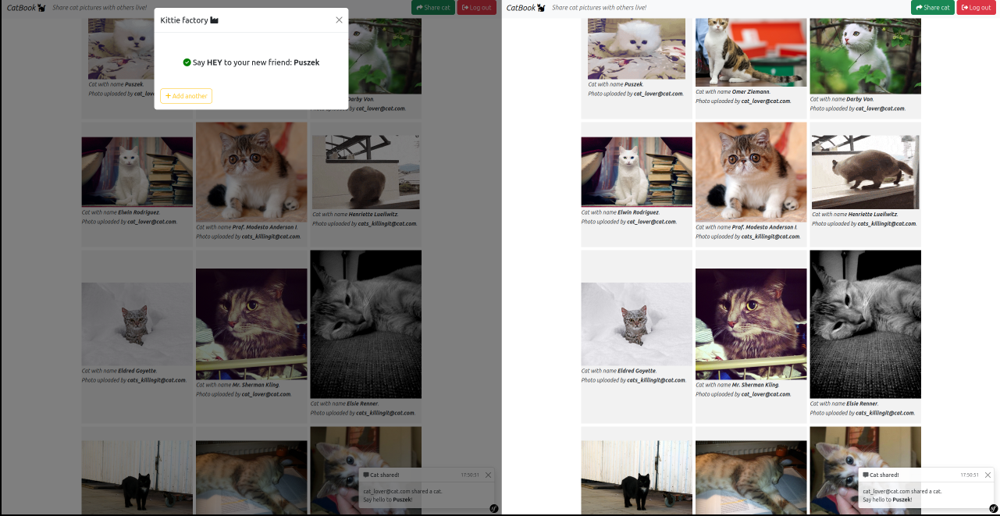

# About

This projects aims to show server-side rendering dynamic web pages with usage of **Symfony UX**, **Symfony** framework itself 
and broadcast protocol **mercure**. 
This web application allows for sharing cat images with other users live. Just add images of cats and explore images added by others.
Have fun experimenting!

# Installation
> **NOTICE:** This application was created with testing and experimenting purpose in mind so is not ready for production.
> This installation guide was created only for development environment.
## Prerequisites
You must have:
 - php version 8.1 or later installed on your system
 - node.js installed on your system
 - npm or yarn node.js package manager
 - docker compose
 - composer the php package manager
## Quick start
Being in root directory of the app in a terminal run `./setup.sh`. Make sure that the file is executable.
Or you can adjust commands to your needs and run them by yourself.
The script consist of following commands:
- `docker compose up -d` - run container with `dunglas/mercure` image for broadcast purposes
- `composer install --no-interaction` - install all required composer dependencies
- `npm install --force` - install all required node.js dependencies
- `npm run build` - build webpack files
- `./bin/console d:d:c` - create local sqlite database
- `./bin/console d:m:m --no-interaction` - run migrations
- `./bin/console d:f:l --no-interaction` - run fixtures
- `cd public && php -S localhost:8080` - run local php server

> **NOTICE:** If 8080 port is already allocated on your system, and you want to use another port you must change 
> **mercure** service configuration, because of CORS policy. Just exchange `cors_origins http://localhost:8080` with 
> your server URL (line 13 in docker-compose.yml).

> **NOTICE:** If you want to change port binding for **mercure** service then make sure to change also `MERCURE_URL` and
> `MERCURE_PUBLIC_URL` environment variables in `.env` file. Also if you want to run application in a container.
# Quick tour
When running fixtures two users are created to make your life easier:
- `cat_lover@cat.com` with password `mySuperStrongPassword`
- `cats_killingit@cat.com` with password `mySuperStrongPassword`

You can use them to sign in into two separate accounts in two separate windows in a browser to watch broadcast in action. 
Or you can just create a new account by clicking `sign up`.
When signed in you can have a little fun watching cats on the website. The cats pictures were downloaded when running
`App\DataFixtures\KittieFixture.php` with usage of [The Cat API](https://thecatapi.com/) into `var/files` directory.
Those files are not publicly available.

Now is the time that you can test broadcast in action. Click 'Share cat' in right upper corner of the application. Upload
some image of a cat, give it a name and also specify its breed. You should immediately see new cat prepended in cat gallery
in both windows of your browser. Also, you should receive notifications that a new cat was just added. Otherwise, make sure 
your configuration is correct.
# Reference
If you want to know more about technologies used in this project visit following websites:
- https://en.wikipedia.org/wiki/Broadcasting_(networking)
- https://symfony.com/
- https://symfony.com/bundles/ux-turbo/current/index.html
- https://symfony.com/bundles/ux-dropzone/current/index.html
- https://packagist.org/packages/stof/doctrine-extensions-bundle
- https://mercure.rocks/
- https://ux.symfony.com/
